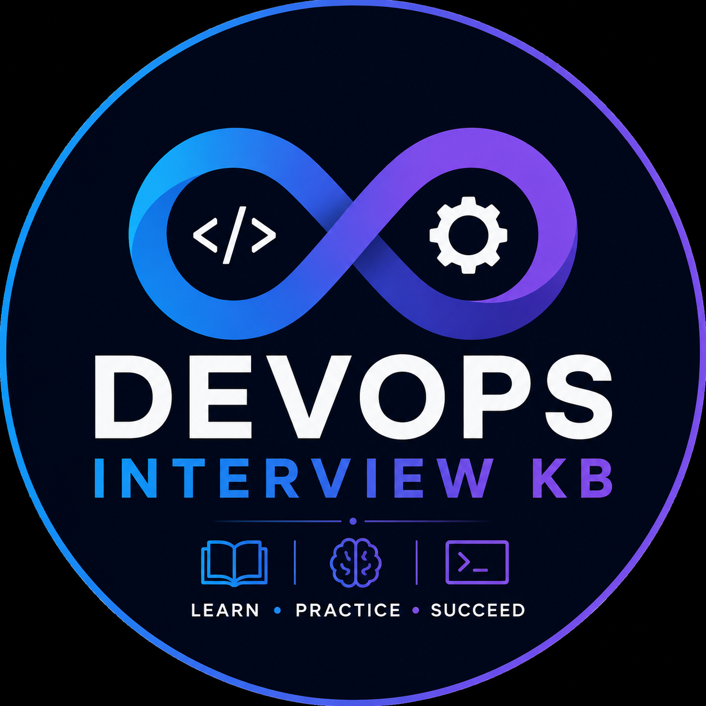

# DevOps Interview KB

<p align="center">
  
</p>

[](https://github.com/audaykumarr/devops-interview-kb/actions/workflows/deploy.yml)
[](https://github.com/audaykumarr/devops-interview-kb/actions/workflows/pr-validation.yml)
[](LICENSE)
[](https://devopsinterviewkb.com)

An open-source DevOps interview preparation **knowledge base and learning
platform** — not just a list of questions.

600 original, scenario-driven questions across 39 categories, covering
DevOps fundamentals, AWS, Azure, GCP, Kubernetes, Terraform, Docker, CI/CD
(GitHub Actions, GitLab CI, Jenkins, Azure Pipelines), security,
observability, networking, and more — organized into Interview Levels,
Question Types, structured Guides, and a staged Roadmap.

🌐 [Website](https://devopsinterviewkb.com) ·
📚 [Guides](https://devopsinterviewkb.com/guides) ·
🗺️ [Roadmap](https://devopsinterviewkb.com/roadmaps/devops-engineer-roadmap) ·
🤝 [Contributing](CONTRIBUTING.md) ·
🐦 [@devopskb](https://x.com/devopskb)

This is not a wall of "what is Docker?" definitions. The focus is practical,
scenario-driven engineering judgment:

> Bad: "What is Docker?"
> Better: "Your Docker container works locally but repeatedly gets OOMKilled in
> Kubernetes. How would you investigate it?"

## The learning experience

```text
Roadmap
   ↓
Guides
   ↓
Practice
   ↓
Interview Questions
   ↓
Interview Mode (planned)
```

A **Roadmap** sequences what to learn and in what order. **Guides** go deep
on a specific technology or domain. **Practice** mode drills the question
bank interactively. Everything ultimately traces back to the **Interview
Questions** themselves — the foundation the rest of the platform is built on.
Interview Mode (timed, assessment-style practice) is planned, not built yet.

## What makes this different

The intent behind the content isn't rote recall — it's the kind of judgment
an interview actually probes:

```text
Conceptual
   ↓
Comparison
   ↓
Practical
   ↓
Scenario
   ↓
Troubleshooting
   ↓
Architecture
```

That's the content philosophy, not a guarantee every single question walks
this exact ladder — but across the bank, the weight leans toward
troubleshooting, real trade-offs, security implications, and production
reasoning over pure definitions. Each question also carries a **Question
Type** (conceptual, comparison, practical, scenario, troubleshooting,
architecture, security, and a few others) and one or more **Interview
Levels** (junior DevOps through staff/principal), so you can filter for
exactly the kind of question and seniority you're prepping for.

## How to use it

### 1. Start with the Roadmap

The [DevOps Engineer Roadmap](https://devopsinterviewkb.com/roadmaps/devops-engineer-roadmap)
sequences the bank into 12 staged areas — foundations through production
readiness — so you know what to learn and in what order, not just what
exists.

### 2. Learn with Guides

Guides provide structured preparation around a major technology or the
whole platform. Currently published:

- [DevOps Interview Guide](https://devopsinterviewkb.com/guides/devops-interview-guide) — the umbrella guide across every domain
- [Kubernetes Interview Guide](https://devopsinterviewkb.com/guides/kubernetes-interview-guide)
- [AWS DevOps Interview Guide](https://devopsinterviewkb.com/guides/aws-devops-interview-guide)
- [Azure DevOps Interview Guide](https://devopsinterviewkb.com/guides/azure-devops-interview-guide)
- [Terraform Interview Guide](https://devopsinterviewkb.com/guides/terraform-interview-guide)
- [GCP Interview Guide](https://devopsinterviewkb.com/guides/gcp-interview-guide)

See the full list at [/guides](https://devopsinterviewkb.com/guides).

### 3. Practice questions

[Practice mode](https://devopsinterviewkb.com/practice) drills the question
bank one card at a time. Filter the whole site — practice, browse, or
[search](https://devopsinterviewkb.com/search) — by category, technology,
difficulty, interview level, and question type to focus on exactly what
you need.

### 4. Go deeper

Every category and technology has its own page — for example
[/kubernetes](https://devopsinterviewkb.com/kubernetes) or
[/technologies/terraform](https://devopsinterviewkb.com/technologies/terraform)
— filterable the same way, for open-ended exploration once you know what
you're looking for.

## Coverage

DevOps fundamentals, Linux, Bash, Python · Git, GitHub, GitLab · CI/CD,
GitHub Actions, GitLab CI, Jenkins, Azure Pipelines · Docker, Kubernetes,
Helm · Terraform, Ansible · AWS, Azure, GCP · Security, DevSecOps ·
Monitoring, Observability, SRE · GitOps, Argo CD · Networking, Databases ·
System Design, real-world Scenarios, Troubleshooting.

Coverage depth varies by topic — some areas (Kubernetes, AWS, Azure, Terraform, GCP)
go deep with dedicated Guides; others are lighter today and are exactly
where the [content-gap report](#follow-up-question-coverage) and community
contributions matter most.

## Guides

Guides are structured learning and interview-preparation paths around
major areas of the knowledge base — what to focus on, why it matters, and
which questions in the bank are most representative, without duplicating
the question content itself.

| Guide | Scope |
| --- | --- |
| [DevOps Interview Guide](https://devopsinterviewkb.com/guides/devops-interview-guide) | Umbrella guide spanning every domain in the bank |
| [Kubernetes Interview Guide](https://devopsinterviewkb.com/guides/kubernetes-interview-guide) | Kubernetes and Helm |
| [AWS DevOps Interview Guide](https://devopsinterviewkb.com/guides/aws-devops-interview-guide) | AWS |
| [Azure DevOps Interview Guide](https://devopsinterviewkb.com/guides/azure-devops-interview-guide) | Azure |
| [Terraform Interview Guide](https://devopsinterviewkb.com/guides/terraform-interview-guide) | Terraform |
| [GCP Interview Guide](https://devopsinterviewkb.com/guides/gcp-interview-guide) | GCP |

## Roadmap

The current published roadmap is the
**[DevOps Engineer Roadmap](https://devopsinterviewkb.com/roadmaps/devops-engineer-roadmap)**
— a staged learning path from foundations through production readiness,
with live progress tracking as you work through it.

Role-specific roadmaps (Cloud Engineer, DevSecOps, SRE, Platform Engineer,
Senior DevOps) are planned future work, not yet published.

## Why this exists

Most interview-prep content is either a wall of definitions or a static PDF
that goes stale the moment a tool ships a new major version. This project
treats interview content the way you'd treat infrastructure:
version-controlled, schema-validated, reviewed via pull request, and built
from a single source of truth.

```text
GitHub Repository (Markdown + frontmatter, this repo)
        │
        ▼
Validation (content, Guides, Roadmaps — schema + cross-reference checks)
        │
        ▼
Generation (questions.json, statistics.json, guides.json, roadmaps.json, ...)
        │
        ▼
Next.js Website (search, categories, filters, Guides, Roadmap, practice)
```

The repository is the source of truth. The website is a presentation layer
generated from it. There is no world where a question, Guide, or Roadmap
stage is edited on the website and not in Git, or vice versa. See
[ARCHITECTURE.md](ARCHITECTURE.md) for the reasoning behind the key
technical decisions.

## Project status

- **Content model**: schema, taxonomy, sample questions, contribution
  workflow — see [Content model](#content-model).
- **Content engine**: generated content index and statistics,
  near-duplicate-title detection, a related-question suggestion engine, a
  follow-up-question content-gap report, and Guide/Roadmap indexes — see
  [Content engine](#content-engine).
- **Website**: Next.js homepage, category/technology/difficulty/interview-level/
  question-type pages, question pages, search with filtering, Practice
  mode, Guides, the DevOps Engineer Roadmap, responsive/dark mode design —
  see [Website](#website).
- **SEO**: canonical URLs, OpenGraph/Twitter metadata, per-question generated
  OG images, structured data (`QAPage`, `TechArticle`, `Course`,
  `BreadcrumbList`), sitemap, robots.txt — see [SEO](#seo).
- **CI/CD**: PR validation workflow (typecheck, content validation, unit
  tests, build, full Playwright suite) and a main-branch deploy workflow
  targeting Vercel — see [CI/CD & Deployment](#cicd--deployment).

What's next is expanding the knowledge base, deepening Guides and Roadmaps,
improving the interview-practice experience, and growing the open-source
community — see [Contributing](#contributing).

## Repository structure

```text
content/                      Question content, one file per question
  <category>/<subcategory>/<slug>.md
  guides/                     Guide content (structured Markdown + frontmatter)
  roadmaps/                   Roadmap content (staged learning paths)
schemas/
  question.schema.json        JSON Schema for question frontmatter
  guide.schema.json           JSON Schema for Guide frontmatter
  roadmap.schema.json         JSON Schema for Roadmap frontmatter
  taxonomy.json               Registry of valid top-level categories
scripts/
  validate-content.ts         Content validation CLI
  validate-guides.ts          Guide validation CLI
  validate-roadmaps.ts        Roadmap validation CLI
  generate-*.ts               Content engine CLIs (index/stats/related/guides/roadmaps)
  lib/                        Pure, unit-tested content engine logic
  tests/                      Unit + integration tests (npm test)
templates/
  question.md                 Copy-paste starting point for a new question
.github/
  ISSUE_TEMPLATE/
    new-question.md           Propose a question without writing the Markdown yourself
app/                          Next.js App Router pages (site, sitemap, robots, OG images)
components/                   Shared React components
lib/                          Website data-access layer (reads generated/ + content/)
e2e/                          Playwright end-to-end tests (npm run test:e2e)
```

## Content model

Every question is a Markdown file with YAML frontmatter under
`content/<category>/<subcategory>/<slug>.md`. See
[templates/question.md](templates/question.md) for the full authoring template, and
any file under [content/](content/) for a filled-in example — for instance
[content/kubernetes/troubleshooting/pod-stuck-crashloopbackoff-after-config-change.md](content/kubernetes/troubleshooting/pod-stuck-crashloopbackoff-after-config-change.md).

Frontmatter fields are validated against
[schemas/question.schema.json](schemas/question.schema.json):

| Field | Purpose |
| --- | --- |
| `id` | Globally unique identifier |
| `title` | The actual interview question |
| `category` / `subcategory` | Taxonomy placement (`category` must exist in `schemas/taxonomy.json`) |
| `technologies` | Specific tools/platforms involved |
| `difficulty` | `beginner` \| `intermediate` \| `advanced` \| `expert` |
| `question_type` | One or more of: `conceptual`, `practical`, `troubleshooting`, `scenario`, `architecture`, `hands-on`, `command-line`, `configuration`, `coding`, `system-design`, `security`, `behavioral`, `comparison` |
| `tags` | Free-form, for search/filtering |
| `estimated_time_minutes` | Roughly how long a strong answer takes to deliver |
| `companies` | Optional, only if publicly known to be asked there |
| `related_questions` | IDs of related questions, for internal linking |
| `status` | `draft` \| `published` \| `deprecated` |
| `last_reviewed` / `last_updated` | Freshness tracking (DevOps tooling changes fast) |
| `technology_version` | Explicit versions referenced, for version-sensitive content |

The body always includes **Question**, **Short Answer**, **Detailed Explanation**,
and **Key Takeaways**. Troubleshooting questions additionally include
**Symptoms**, **Possible Causes**, **Investigation Steps**, **Commands**,
**Resolution**, and **Prevention**. Architecture questions additionally include
**Requirements**, **Assumptions**, **Architecture**, **Components**,
**Trade-offs**, **Failure Scenarios**, **Security**, **Scalability**, and
**Cost Considerations**.

Interview Level (e.g. Junior DevOps, SRE, Staff/Principal) isn't hand-authored
per question — it's computed deterministically from `difficulty`, `category`,
and `question_type`, so it can never drift out of sync as content changes.

Guides ([schemas/guide.schema.json](schemas/guide.schema.json)) and Roadmaps
([schemas/roadmap.schema.json](schemas/roadmap.schema.json)) are separate
content types with their own schemas — they reference questions dynamically
by category rather than duplicating question content.

## Getting started

```bash
npm install
npm run validate      # validate all content against the schema
npm run build:content # validate, then generate the full content index/stats/related/guides/roadmaps output
npm test               # run the unit + integration test suite
npm run typecheck      # typecheck the tooling scripts
```

## Content engine

Everything under `scripts/` is a thin CLI over pure, unit-tested functions in
`scripts/lib/` — see [scripts/tests/](scripts/tests/) for the test suite
(`npm test`).

| Command | What it does |
| --- | --- |
| `npm run validate` | Validates every `content/**/*.md` question file's frontmatter against the JSON Schema, confirms `category` is a registered taxonomy slug, checks `id` uniqueness and `related_questions` integrity across the whole corpus, confirms required body sections are present per `question_type`, flags placeholder text, and warns (non-fatally) on near-duplicate titles within the same category. |
| `npm run validate:guides` | Validates Guide frontmatter and cross-references (categories, `featured_questions`, `related_guides`) and required body sections. |
| `npm run validate:roadmaps` | Validates Roadmap frontmatter, stage cross-references (categories, `recommended_questions`, `related_guides`, `prerequisites`), checks for circular prerequisites, and required body sections. |
| `npm run generate:index` | Writes `generated/questions.json` — the lean, website-facing index (metadata only, no body content) the website consumes for search/filter/routing. |
| `npm run generate:guides` | Writes `generated/guides.json` — the Guide index, with `question_count` always derived live from the current question index. |
| `npm run generate:roadmaps` | Writes `generated/roadmaps.json` — the Roadmap index, with every stage's question count derived live. |
| `npm run generate:stats` | Writes `generated/statistics.json` — counts by category, difficulty, technology, question type, interview level, and status, plus the most recently updated questions. |
| `npm run generate:related` | Writes `generated/related-suggestions.json` (candidate `related_questions` links for a maintainer to review) and `generated/content-gaps.json` (the follow-up-question coverage report described below). |
| `npm run build:content` | Runs all of the above in order; any validation failure stops the pipeline before generation runs. |

`generated/` is build output, not source — it's gitignored and gets rebuilt
from `content/` locally, in CI, and as part of every deploy.

### Follow-up question coverage

Every question's **Interview Follow-Up Questions** section is prose, not a
set of links — but a follow-up like *"How would this differ on ECS instead of
EC2?"* is worth answering if it isn't already, somewhere in the corpus.
`npm run generate:related` scores each follow-up bullet against the rest of
the corpus (scoped to the same category/tags/technologies, not naive text
matching):

- **Matched** — an existing question already covers it closely; a good
  candidate for an explicit `related_questions` link.
- **Gap** — no existing question is a close match; a prioritized candidate
  for future content (see [ARCHITECTURE.md](ARCHITECTURE.md), decision 8).

## Website

Next.js (App Router) + TypeScript + Tailwind CSS. It reads `generated/` and
`content/` at build time — the `predev`/`prebuild` npm hooks run
`build:content` automatically, so `npm run dev` and `npm run build` are always
working from fresh content.

```bash
npm run dev     # local dev server at http://localhost:3000
npm run build   # production build (validates content first; fails the build on invalid content)
npm start       # serve the production build
```

| Route | Purpose |
| --- | --- |
| `/` | Homepage — stats, browse by category/difficulty/technology, Guides/Practice entry points |
| `/<category>` | Category page (e.g. `/aws`, `/kubernetes`), filterable via `?difficulty=&technology=&type=&subcategory=` |
| `/technologies/<technology>` | Technology page, filterable via `?difficulty=&category=&type=` |
| `/difficulty/<level>` | Difficulty page, filterable and paginated |
| `/level/<level>` | Interview Level page (e.g. `/level/sre`), aggregating across categories |
| `/type/<type>` | Question Type page (e.g. `/type/troubleshooting`), aggregating across categories |
| `/questions/<category>/<subcategory>/<slug>` | Question detail page |
| `/search` | Client-side instant search with the full filter set |
| `/practice` | Flashcard-style practice mode with progress tracking |
| `/guides`, `/guides/<slug>` | Guides index and detail pages |
| `/roadmaps`, `/roadmaps/<slug>` | Roadmap index and detail pages |

Filters on browse pages are URL search params (shareable, server-rendered);
`/search` and `/practice` are fully client-interactive, with the same
filter logic reused rather than reimplemented per page. Related questions
prefer curated `related_questions` links and label any
`generated/related-suggestions.json` fallback as "Suggested" rather than
presenting it as human-curated.

Light/dark mode follows the OS preference by default; the header toggle
(light/dark/system) overrides it and persists the choice in `localStorage`
(`lib/theme.ts`), with an inline pre-hydration script so there's no
flash-of-wrong-theme on load.

## SEO

Every page's metadata goes through one function, `buildMetadata()`
(`lib/seo.ts`), so canonical URLs and OpenGraph/Twitter fields can't be
forgotten on any individual page:

- **Canonical URLs** on every page via `alternates.canonical`.
- **OpenGraph + Twitter Card** metadata, plus a real per-question preview
  image generated at build time (`app/questions/.../opengraph-image.tsx`,
  via `next/og`) — question title, category, and difficulty rendered onto a
  branded 1200×630 card. Other pages use a shared default
  (`app/opengraph-image.tsx`).
- **Structured data** (JSON-LD, `lib/structured-data.ts`): `BreadcrumbList`
  on every page with breadcrumbs, `QAPage`/`Question`/`Answer` on question
  pages, `TechArticle` on Guides, and `Course` on Roadmaps.
- **Sitemap** (`app/sitemap.ts`) — home, populated category/technology/
  difficulty/level/type pages, published Guides and Roadmaps, and every
  question, with `lastModified` from `last_updated`. Empty categories,
  noindexed thin question types, and `/search` result variants are
  excluded to avoid thin/duplicate-content entries.
- **robots.txt** (`app/robots.ts`) — allows everything except parameterized
  `/search?*` and `/practice?*` results (a JS-rendered subset of
  already-indexed pages).

Set `NEXT_PUBLIC_SITE_URL` (see [.env.example](.env.example)) to your real
production origin before deploying — canonical URLs, OpenGraph URLs, the
sitemap, and robots.txt all derive from it and fall back to
`http://localhost:3000` otherwise.

### End-to-end tests

```bash
npm run test:e2e
```

Playwright ([playwright.config.ts](playwright.config.ts),
[e2e/site.spec.ts](e2e/site.spec.ts)) builds and serves the production site,
then checks — on both a desktop and a mobile viewport — that the homepage,
category/technology/level/type pages, question pages, search, Practice
mode, Guides, the Roadmap (including progress tracking), filters, SEO
metadata, and the sitemap/robots.txt all work, with zero browser console
errors and no horizontal overflow. The suite grows alongside the site
rather than staying fixed at a specific count.

## CI/CD & Deployment

Two GitHub Actions workflows, both least-privilege (`permissions: contents: read`,
no repo write access) and pinned to major-version action tags:

- **[pr-validation.yml](.github/workflows/pr-validation.yml)** — every PR
  targeting `main`: install, typecheck, content validation, unit tests,
  production build, then the full Playwright suite (desktop + mobile). Any
  failure blocks the PR. Nothing here needs secrets, so it runs safely
  against PRs from forks.
- **[deploy.yml](.github/workflows/deploy.yml)** — every push to `main`:
  re-validates (defense-in-depth, in case `main` was ever updated without
  going through a PR), then builds and deploys to Vercel via the Vercel CLI
  (`vercel pull` → `vercel build` → `vercel deploy --prebuilt --prod`).

### One-time setup before `deploy.yml` will work

1. Create a Vercel project for this repo (via the Vercel dashboard or
   `vercel link` run locally from the project root — the latter also prints
   the org/project IDs you need next).
2. Add three **GitHub repository secrets** (Settings → Secrets and
   variables → Actions):
   - `VERCEL_TOKEN` — a personal token from your Vercel account settings.
   - `VERCEL_ORG_ID` and `VERCEL_PROJECT_ID` — from `.vercel/project.json`
     after running `vercel link` locally, or from the Vercel project's
     settings page.
3. In the **Vercel project's own environment variables** (not GitHub
   secrets — `vercel build` reads these), set `NEXT_PUBLIC_SITE_URL` to your
   real production domain for the Production environment. This is what
   makes canonical URLs, OpenGraph URLs, the sitemap, and robots.txt correct
   in production (see [SEO](#seo)) — without it they'll default to
   `http://localhost:3000`.
4. Recommended: in GitHub, enable branch protection on `main` requiring the
   `PR Validation` workflow to pass before merging. This is a repo setting,
   not something a workflow file can configure on its own.

If you'd rather not manage tokens, Vercel's native Git integration (connect
the repo directly in the Vercel dashboard) deploys on every push with zero
GitHub Actions involvement — a simpler alternative to `deploy.yml` if you
don't need deploys gated behind your own CI first. Don't enable both at
once; that would double-deploy every push.

## Contributing

Contributions are welcome — not just new questions:

- New interview questions
- Improving or correcting existing questions
- Guides and Roadmap content
- Documentation
- Tooling, tests, and UX improvements

See [CONTRIBUTING.md](CONTRIBUTING.md) for the full workflow. For a new
question specifically: fork, copy [templates/question.md](templates/question.md)
into the right `content/<category>/<subcategory>/` directory, fill it in
with **original** content, run `npm run validate`, and open a PR. All
content must be original — see
[CONTRIBUTING.md](CONTRIBUTING.md#originality) for what that means in
practice.

Don't see a topic covered? Request a question or suggest an improvement
through [GitHub Issues](https://github.com/audaykumarr/devops-interview-kb/issues/new/choose)
using the question-request template.

---

🌐 **[devopsinterviewkb.com](https://devopsinterviewkb.com)** — the live
site. 📦 **[This repository](https://github.com/audaykumarr/devops-interview-kb)**
is the source of truth for every question, Guide, and Roadmap on it —
nothing is edited on the website directly.

⭐ If this project helps with your interview preparation, consider starring
the repository.

## License

[MIT](LICENSE).
